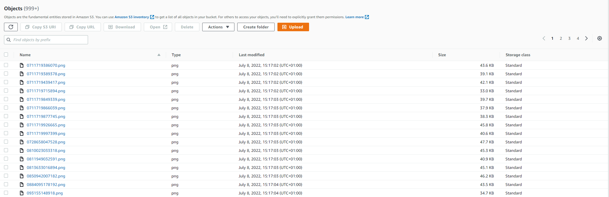
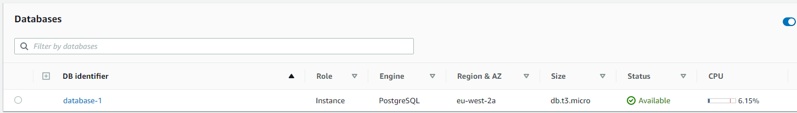
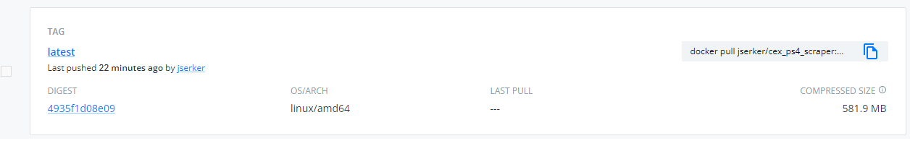
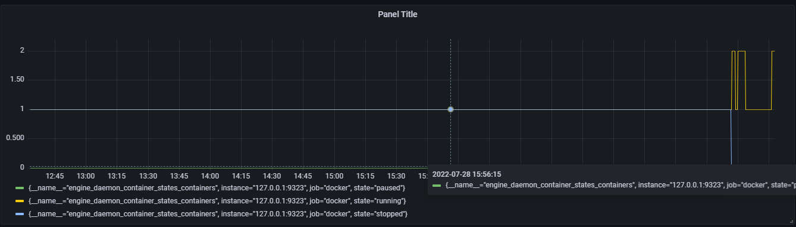

# Data Collection Pipeline

> Create and apply a web scraper class to gather info from a chosen website

## Milestone 1 - Picking the website

Chose the website https://uk.webuy.com/ to gather info from. This was chosen as it is probabl the one thing i am most passionate about, games, and i usnderstandf all the information avaliable. Made sure to check the robots.txt to see if the scraping was allowed by the website

## Milestone 2 - Creating a webscraper class

Used selenium to open a firefox browser and open the desired url. The url opened was https://uk.webuy.com/boxsearch/?superCatId=1 as this allows for all the information that i wanted to be gathered. The ability to scroll, click a button based off a tick and search by text values and others were included in the scraper class. This was my first time using OOP and it was a struggle to get to grips with. Definatley not the best, and takes a while to get the info, but it works. Ill improve it in the future.

```python
from selenium import webdriver
from selenium.common.exceptions import NoSuchElementException
from selenium.webdriver.support.ui import WebDriverWait 
from selenium.webdriver.support import expected_conditions as EC
from selenium.webdriver.common.by import By
import time
import random
import numpy as np
import pandas as pd
```
```python
class scraper():
    
    def __init__(self, pause):
        if __name__ == "__main__":
            #Open Firefox
            self.driver = webdriver.Firefox()
            #Set a standard pause
            self.pause = pause
        else:
            print("Uh Oh It Broke!")

    def open_url(self, url):
        #open the url
        self.driver.get(url)
        time.sleep(self.pause)

    def click_but_by_txt(self, TEXT):
        buts = self.driver.find_elements_by_tag_name("button")
        time.sleep(1)
        #Only click if the text on the button matches the given text
        for i in buts:
            if i.text == TEXT:
                i.click()

    def find_single(self, xpath):
        single = self.driver.find_element_by_xpath(xpath)
        time.sleep(self.pause)
        return single

    def find_multi(self, xpath):
        list_ = self.driver.find_elements_by_xpath(xpath)
        time.sleep(self.pause)
        return list_

    def find_multi_class(self, clas):
        list_ = self.driver.find_elements_by_class_name(clas)
        time.sleep(self.pause)
        return list_


    def scroll_down_all(self):

        last_height = self.driver.execute_script("return document.body.scrollHeight")

        while True:

            # Scroll down to bottom
            self.driver.execute_script("window.scrollTo(0, document.body.scrollHeight);")

            # Wait to load page
            time.sleep(5)

            # Calculate new scroll height and compare with last scroll height
            new_height = self.driver.execute_script("return document.body.scrollHeight")
            
            if new_height == last_height:
                break
            last_height = new_height


    
    def find_single_by_txt(self, TEXT):
        xpath = "//*[contains(text(), '{}')]".format(TEXT)
        single = self.driver.find_element_by_xpath(xpath)
        time.sleep(1)
        return single

    def find_multi_by_txt(self, TEXT):
        xpath = "//*[contains(text(), '{}')]".format(TEXT)
        list_ = self.driver.find_elements_by_xpath(xpath)
        time.sleep(1)
        return list_

        
    def get_links_txt(cont, lst):

        links = []

        for i in lst:
            your_needed_xpath = "//*[contains(text(), '{}')]".format(i)
            for i in cont.find_elements_by_xpath(your_needed_xpath):
                if i.get_attribute("href") != None:
                    print(i.text, i.get_attribute("href"))

                    if i.get_attribute("href") not in links:
                        links.append(i.get_attribute("href"))
        return links
```
## Milestone 3 - Retriving Data From Each Product

Used Selenium to retrieve the name, product id and prices of each product. This was done seperatley for each attribute of the product, in its own method. A UUID was also generated based off the products name, ussing the UUID library. These details were then saved into a dictionary to be extracted into a json file. The image of each product was also collected in its own method.

```python
def get_product_name(self, product, prod_name_class):
        """
        A function which returns the name of a product given the class of the element containing the name

        Parameters:
            product = web element of the product
            prod_name_class = class of the name element
            name_element = web element of the name
        Returns:
            product_name = product name
        """
        name_element = product.find_element_by_class_name(prod_name_class)
        product_name = name_element.text
        return product_name

    def get_product_price(self, product, prod_price_class):
        """
        A function which returns the price of a product given the class of the element containing the price
        
        Parameters:
            product = web element of the product
            prod_price_class = class of the price element
        Returns:
            price = web element of the price
        """
        price = product.find_elements_by_class_name(prod_price_class)

        if len(price) == 1:
            return price[0]
        else:
            return price

    def make_uuid(self, product_name):
        """
        A function which creates and returns a uuid based on the products name
        
        Parameters:
            product_name = name of the product (string)
        Returns:
            uuid_str = generated uuid (String)
        """
        uuid_str = str(uuid.uuid3(uuid.NAMESPACE_DNS, product_name))
        return uuid_str

    def get_prod_id(self, product, product_id_att):
        """
        A function which finds and returns the product id
        
        Parameters:
            product = web element of the product (string)
            product_id_att = attribute of the product id
        Returns:
            id = product id (string)
        """
        id = product.get_attribute(product_id_att)
        return str(id)
        
    def save_screenshots_locally(self, element, folder, filename):
        """
        A function which finds and saves an image for a product given the element containing the image
        
        Parameters:
            element = web element of the image container (WebElement)
            folder = The name of the folder the images will be stored in (string)
            filename = Name of the image we want saves (string)
        Returns:
        """
        element.screenshot(f'.\{folder}\{filename}.png')
```
## Milestone 4 - Testing the methods

Used the unittesting library to create a unit test for each of my methods. These tests open a web page and use each method to retrive information. This information is then compared to the expected result. The test passes or fails based on if the assertion between the expected value and retrieved value is True. I could have made more tests to make the scraper more robust, and maybe use different web pages, but as this was my first time using unittesting, i kept it simple and easy to understand.

```python

class ProductTestCase(unittest.TestCase):

    def test_click_but_by_text(self):
        driver = scraper(5)
        driver.open_url("https://uk.webuy.com/boxsearch?superCatId=1")
        all_buttons = driver.driver.find_elements_by_tag_name("button")
        text_lst = []
        for i in all_buttons:
            text_lst.append(i.text)
        assert("Accept Cookies" in text_lst)

    def test_get_products(self):
        driver = scraper(5)
        driver.open_url("https://uk.webuy.com/boxsearch?categoryIds=1141")
        driver.click_but_by_txt("Accept Cookies")
        records = driver.get_products('//div[@class="content-area"]', "searchRcrd")
        assert (len(records) == 50)

    def test_get_product_name(self):
        driver = scraper(5)
        driver.open_url("https://uk.webuy.com/boxsearch?categoryIds=1141")
        driver.click_but_by_txt("Accept Cookies")
        records = driver.get_products('//div[@class="content-area"]', "searchRcrd")
        name = driver.get_product_name(records[0], "ais-highlight")
        assert("Spider-Man: Miles Morales (No DLC)" == name)

    def test_get_product_price(self):
        driver = scraper(5)
        driver.open_url("https://uk.webuy.com/boxsearch?categoryIds=1141")
        driver.click_but_by_txt("Accept Cookies")
        records = driver.get_products('//div[@class="content-area"]', "searchRcrd")
        price = driver.get_product_price(records[0], "priceTxt")
        selling = price[0].text.split(" ")[-1]
        assert selling == "£22.00"

    def test_get_prod_id(self):
        driver = scraper(5)
        driver.open_url("https://uk.webuy.com/boxsearch?categoryIds=1141")
        driver.click_but_by_txt("Accept Cookies")
        records = driver.get_products('//div[@class="content-area"]', "searchRcrd")
        id = driver.get_prod_id(records[0], "data-insights-object-id")
        assert str(id) == "711719835929"

unittest.main(argv=[""], verbosity=2, exit=False)

```
## Milestone 5 - Scalably Storing the data

Created a AWS S3 bucket to store all the raw json files and images in. This was my first time using the s3 bucket and AWS. The tabular data (Prices, names and IDs) were also stored in a RDS using postgres and PgAdmin4. This was tricky as i have never used SQL before, but as i progressed it got easier and easier to manipulate the database.





## Milestone 6 - Preventing Recraping

By Connecting to the RDS Database and reading all the product IDs, i can have a list of all IDs that have been uploaded to the RDS. By Checking if the scraped ID is in this list at the start of each search result, we can prevent scraping the same product more than once.

```python

    def check_product_id(self, table_name, product_id):
        """
        A function that uploads the data to the RDS database server
        """
        DATABASE_TYPE = 'postgresql'
        DBAPI = 'psycopg2'
        HOST = 'database-1.csoiffuysgtp.eu-west-2.rds.amazonaws.com'
        USER = 'postgres'
        PASSWORD = 'Erzacana_01'
        DATABASE = 'cex--data'
        PORT = 5432
        engine = create_engine(f"{DATABASE_TYPE}+{DBAPI}://{USER}:{PASSWORD}@{HOST}:{PORT}/{DATABASE}")
        engine.connect()
        uploaded = engine.execute(f"""SELECT product_id FROM {table_name}""").fetchall()
        uploaded_ids = []
        for id_tuple in uploaded:
            uploaded_id = id_tuple[0]
            uploaded_ids.append(uploaded_id)
        if product_id in uploaded_ids:
            return True
        else:
            return False

    def upload_data_RDS(self,table_name, uudi, product_id, name, selling, cash, voucher):
        """
        A function that uploads the data to the RDS database server
        """
        DATABASE_TYPE = 'postgresql'
        DBAPI = 'psycopg2'
        HOST = 'database-1.csoiffuysgtp.eu-west-2.rds.amazonaws.com'
        USER = 'postgres'
        PASSWORD = 'Erzacana_01'
        DATABASE = 'cex--data'
        PORT = 5432
        engine = create_engine(f"{DATABASE_TYPE}+{DBAPI}://{USER}:{PASSWORD}@{HOST}:{PORT}/{DATABASE}")
        engine.connect()
        engine.execute(self.make_SQL(table_name, self.make_data_format(uudi, product_id, name, selling, cash, voucher)))
    def save_data_locally(self, filename, record_details):
        """
        A function to save the data locally
        """
        with open(filename, 'w') as fp:
            json.dump(record_details, fp,  indent=4)

    def data_choice(self, table_name):
        """
        A function to give the user a choice to upload or save the data locally
        """
        locally = int(input("To save data locally - press 1"))
        upload = int(input(f"To upload data to the {table_name} table - press 1"))
        return locally, upload

    def save_data(self,filename,local_choice, upload_choice, record_details, table_name):
        """
        Save the data either locally or upload it using the other methods and based on the users choice
        """

        already_uploaded = self.check_product_id(table_name, record_details[1])

        if local_choice != 1 and upload_choice != 1:
             print("NO DATA WILL BE SAVED")
        elif local_choice == 1 or upload_choice == 1:
            if already_uploaded == False:
                if local_choice == 1 and upload_choice == 1:
                    self.save_data_locally(filename, record_details)
                    self.upload_data_RDS(table_name, record_details[0], record_details[1], record_details[2], record_details[3], record_details[4], record_details[5])
                elif local_choice == 1 and upload_choice != 1:
                    self.save_data_locally(filename, record_details)
                elif local_choice != 1 and upload_choice == 1:
                    self.upload_data_RDS(table_name, record_details[0], record_details[1], record_details[2], record_details[3], record_details[4], record_details[5])
                else:
                    print("NO DATA WILL BE SAVED")

            elif already_uploaded == True:
                print(f"Product with product-id {record_details[1]} has already been uploaded to the table {table_name}")

    def make_data_format(self, uuid, product_id, name, selling, cash, voucher):
        """
        A function to format the data to allow it to be used in the SQL
        """
        name = name.replace("'", "")
        data_formatted = f"('{uuid}', '{product_id}', '{name}', '{selling}', '{cash}', '{voucher}')"
        return data_formatted

    def make_SQL(self, table_name, data):
        """
        A function that crates the SQL Query to upload the data into a table (TABLE HAS TO EXIST ALREADY)
        """
        SQL = f'''INSERT INTO {table_name} VALUES {data}'''
        return SQL
```
## Milestone 7 - Containerising the scraper and running it on the cloud

Using Docker, the scraper class, and the CEX_scraping.py file can be containerised in a docker image, which can then be ran in a docker container on any system. The requirements of the scraper were also needed to build the docker image. Once the docker image was build and ran sucessfully on the local machine, A EC2 instance (t2.medium) was used to run the docker container. The scraper itself required some options to be included for a sucessfull launch (headless etc.).



## Milestone 8 - Monitoring the Docker container

Using a prometheus container that is connected to the ec2 instance via a "prometheus.yml" file, we can monitor the hardware of the instance (cpu usage and memory). Prometheus can also be connected to docker to monitor the health of containers. This was done by modifying the daemon.json file and the proemtheus.yml file to connect. The metrics gathered were then monitored using Grafana



## Conclusions

- This project helped me understand that breaking down the project into achievable goals can help understand whats going on and figure out what the next step is and how to do it. To improve, i would move the round timer onto the screen and make it so the camera doesnt close every round
